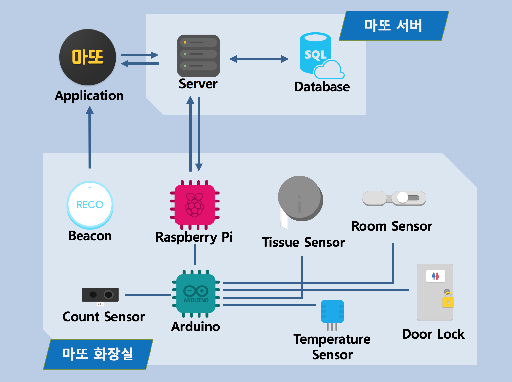
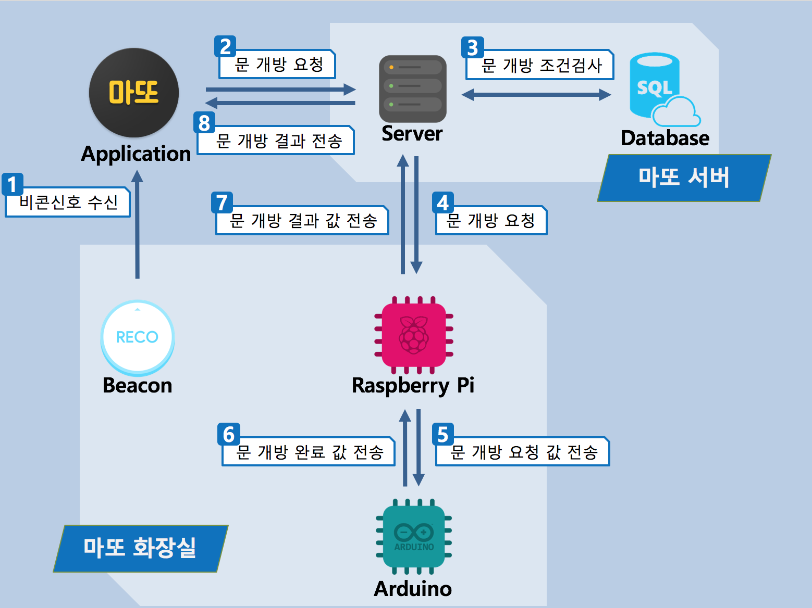
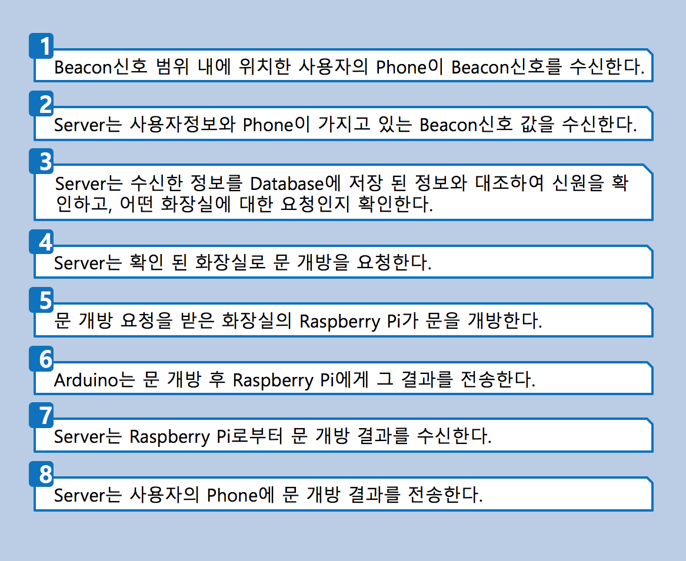
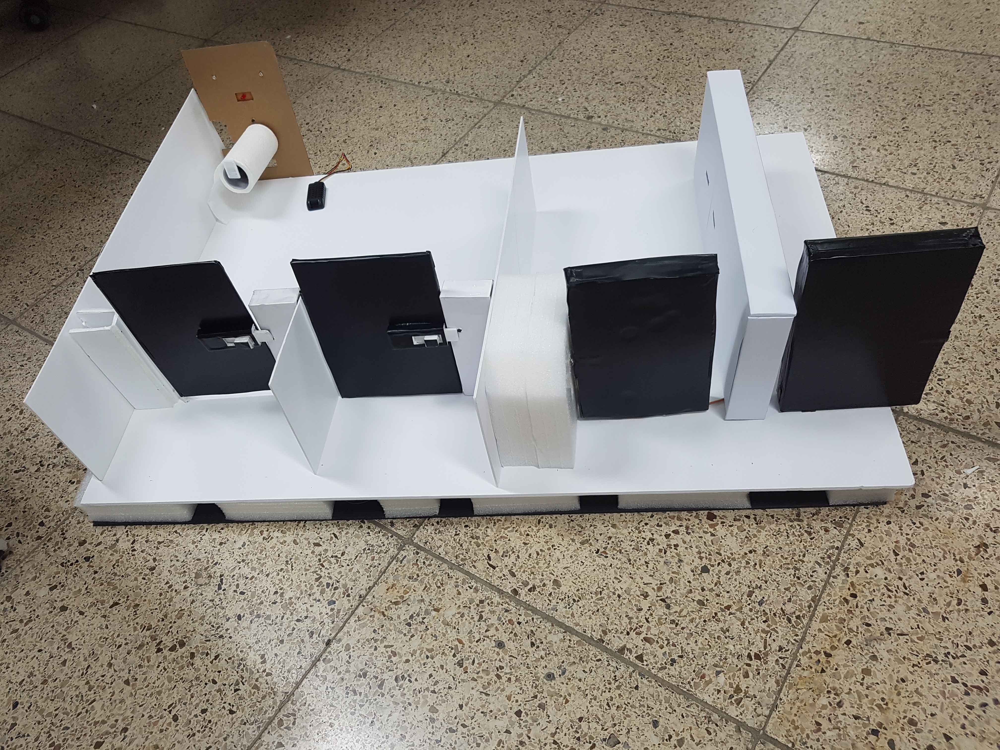

# Project Matto

## 여담
처음으로 협업 툴들을 최대한 활용하고, 프로젝트 답게 진행했던 프로젝트.  

`Git`을 최대한 활용하였지만, 아직 사용이 서툴러 커밋도 제대로 이루어지지 않았고, 브랜치도 좋지 않았던것 같다.  
한이음에 제출할 문서들이 많아 문서 작업도 오래 하였으며, 공모전, 특허, 논문까지 진행을 하여 성취감도 컸던 프로젝트이다.  

내가 서버 개발에 흥미를 가지게 된 프로젝트이다.  
간단하지만, 라즈베리파이 서버를 `Node.js` 를 통해 개발하였다.  

현재 클라우드서버는 운영하지 않고 있다.  

## 프로젝트 명세
`한이음ICT` 멘토링 지원 프로그램을 통해 진행한 프로젝트이다.  

`IoT` 기술을 활용하여 `안정성`과 `청결성`, `편의성`을 높인 공중 화장실 관리 시스템.  
화장실 출입문에 설치한 `비콘`과 스마트폰 `App`을 통해 사용자를 인증하여 스마트 화장실의 문을 개방한다.  
사용자는 스마트폰 `App`을 통해 화장실의 위치조회, 길안내, 사용 중인 인원, 빈칸 정보, 휴지의 양 등 여러 가지 정보를 조회할 수 있다.  

좀 더 자세한 프로젝트 설명은 결과보고서에 작성되어 있다.  
[동작 영상 유튜브 링크](https://youtu.be/twX8YfiCI48)  
[결과 보고서 pdf](./docs/DP_result.pdf)  
[정보과학회 논문 pdf](./docs/DP_thesis.pdf)  

클라우드 서버는 전체 화장실 서버를 통제하며, 각 화장실에 서버가 존재한다.  
각 화장실 서버는 `아두이노`와 통신하여 하드웨어를 제어한다.  
사용자는 스마트폰 `App` 으로 모든것을 컨트롤한다.

위 사진은 문 개방에 대한 시나리오이다.  

위 사진은 하드웨어가 포함된 화장실의 모형이다.  

## 진행기간
2016.06.03 ~ 2016.12.18  

## 역할분담
|이름|역할|
|:----:|---|
|박미화|멘토|
|윤상현|PM, HW개발|
|박현식|Server 개발|
|최한규|Server 개발|
|엄선오|Android 개발|
|박현기|Android 개발, 디자인|

## 주요기능
* **비콘**  
화장실에 설치된 `비콘`의 신호를 스마트폰 `App`에서 감지하여 사용자가 화장실 근처에 왔음을 인식하고, 해당 화장실의 문을 열 수 있도록 한다.  
회원 성별에 따라 해당하는 화장실의 문을 개방한다.  
조작이 가능한 `GPS`와는 다르게, 사전에 DB에 넣어둔 `비콘`의 일련번호와 일치한 경우에만 화장실 문이 개방된다.  

* **회원 관리**  
회원정보 중 중요한 비밀번호 등은 `복호화`를 거쳐 저장하였으며, `RESTful API`를 `토큰 인증 방식` 으로 보안성을 높였다.  

* **화장실 내 하드웨어**  
화장실에는 휴지의 잔량을 체크하는 센서, 사용중인 칸을 체크하는 센서, 온습도센서, 인원수 카운팅 센서 등이 존재하여 사용자에게 각종 정보를 제공한다.  
서보모터를 이용하여 도어락 모형을 직접 제작하였다.  

* **화장실 내 물품 구매**  
하드웨어적으로 구현은 하지 않았지만, 자판기가 있다는 가정 하에 물품 구매에 대한 서비스를 구현했다.  
`App` 에서 서버 DB의 물품 목록과 연동되어 구매 할 수 있다.  

* **신고 기능**
화장실 사용중 불편한 사항이 생기면, `App` 내의 신고 버튼을 통해 신고 할 수 있다.  
